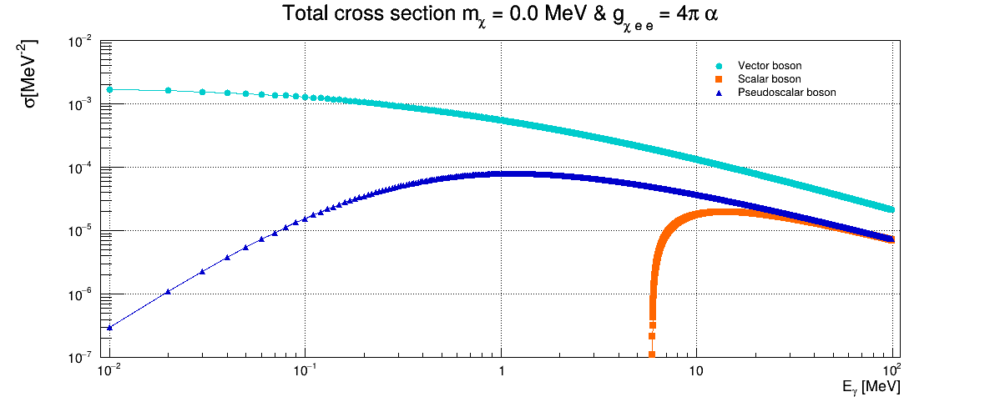

El archivo **DP.C** contendrá la implementación del paper  	
https://doi.org/10.48550/arXiv.1705.02470
arXiv:1705.02470v4

El archivo **DP_aux.C** contiene los siguientes cálculos auxiliares:

1.Sección eficaz total de interacción de gammas con Uranio. Obtenida a partir de tablas de datos nucleares (datos experimentales)

2.Flujo gamma modelado para el reactor FRJ-1, válido para E$_{\gamma \geq 200$ keV}. Ecuación (3) de Park, 2017

3.Secciones eficaces de interacción Compton usuales.
![KN_gammas_no_polarizados[1].pdf](KN_gammas_no_polarizados[1].pdf)
![Thomson_scattering_cross_section[1].pdf](Thomson_scattering_cross_section[1].pdf)

4.Longitud de decaimiento de fotones masivos oscuros. Ecuación (5) de Park, 2017

5. Secciones eficaces totales de producción de fotones masivos. Ecuaciones (A1, A2, A3) de Gondolo, 2009

Lo que sigue está mal:
![Compton_foton_masivo[1].pdf](Compton_foton_masivo[1].pdf)

Calculé la relación de dispersión usando la misma estrategia que para el Compton clásico.
Secciones eficaces de interacción en función de la energía $E_{\gamma}$ y $E_{\gamma'}$. Hice la cuenta clásica y luego copié la estrategia para el caso del fotón masivo.
